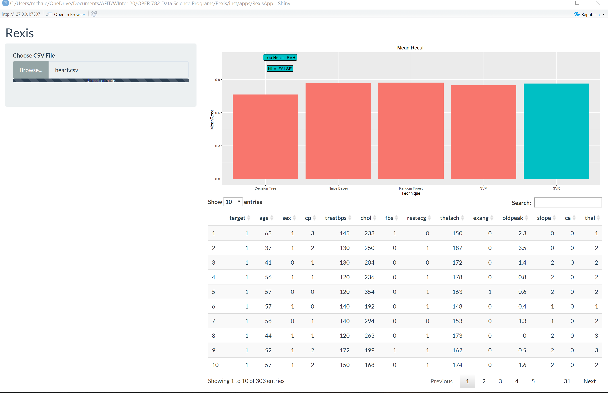

Welcome to Rexis\!
================

## The Machine Learning Technique Recommendation System

Rexis is an R package and Shiny application that serve as a holistic
approach to the algorithm selection problem for machine learning
classification problems. Rexis reads in a .csv data file with binary
targets in the first column. Column headers are encouraged for ease of
use. Rexis then predicts the best algorithms from its built in taxonomy
of algorithms. Next, Rexis performs all recommended algorithms for the
problem and reports their perforance. According to research performed at
the Air Force Institute of Technology, Rexis recommends an excellent algorithm
in 78% of test problems.

    
### Getting Started

To get started, install the Rexis package from the Rexis
project:

``` install
devtools::install_github("marcchale/Rexis", INSTALL_opts=c("--no-multiarch"))
library(Rexis)
```

### Using Rexis

Now you’re ready to use Rexis. Run the following code and browse to the
desired data set. The “Heart”heart.csv" data set is one example included
in the “Rexis/data/” folder. Type ResultsVar into your consolde to see
the performance of the analysis\!

``` use
ResultsVar <- rexecute()
ResultsVar
```

If you prefer the Shiny interface, run the code below in the R console
and select a .csv \!\!

``` use
run_my_app("RexisApp")
```



### Help with Rexis

You can access additional help documentation for the rexicute and the
rexicuteshiny functions in your R IDE.

    ? rexicute
    ? rexicuteshiny

### System Requirements
R 3.6.3
Python 3.7

Python Modules:
Most users are able to use Rexis without implicitly installing specific Python Packages. However, if issues arise, ensure each of the following Python modules run properly on your system.
    import pandas as pd
    import numpy as np
    import time
    import os
    import matplotlib.pyplot as plt
    from sklearn.model_selection import train_test_split
    from sklearn import preprocessing
    from sklearn.ensemble import RandomForestClassifier
    from sklearn.naive_bayes import MultinomialNB
    from sklearn.metrics import  recall_score #,precision_score
    from sklearn import svm
    from sklearn.svm import SVR
    from scipy.stats import t
    from scipy.stats import spearmanr
    from sklearn.tree import DecisionTreeClassifier
    from ParamGet import ParamGet
    from matplotlib.patches import Patch
    from matplotlib.lines import Line2D
    from pareto import identify_pareto
    from adjustText import adjust_text
    from matplotlib.text import OffsetFrom

### Additional Resources

If you would like to read the AFIT Thesis that used the Rexis software,
please email <marc.chale@afit.edu>

If you are searching for information on Rexis, Pennsyvania, please see
the following link [Rexis,
PA](https://en.wikipedia.org/wiki/Rexis,_Pennsylvania)

If you are searching for information on Regis Philbin, please see the
following link [Regis](https://en.wikipedia.org/wiki/Regis_Philbin)
